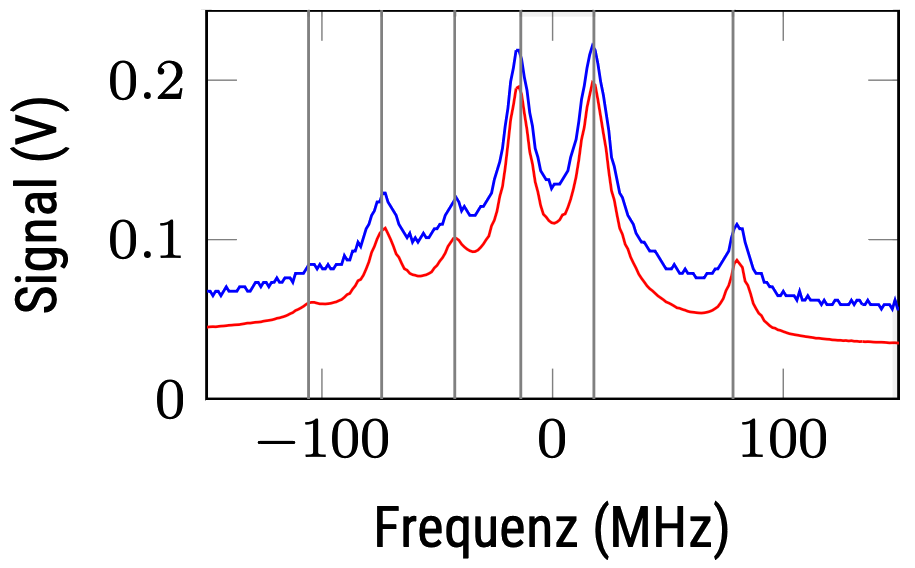

[![CC BY-SA 4.0][cc-by-sa-shield]][cc-by-sa]

This work is licensed under a
[Creative Commons Attribution-ShareAlike 4.0 International License][cc-by-sa].

[cc-by-sa]: http://creativecommons.org/licenses/by-sa/4.0/
[cc-by-sa-image]: https://licensebuttons.net/l/by-sa/4.0/88x31.png
[cc-by-sa-shield]: https://img.shields.io/badge/License-CC%20BY--SA%204.0-lightgrey.svg

# Doppler-freie Spektroskopie von Rb

Dieses [Experiment](Anleitung_Rb_dopplerfrei.pdf) zeigt, wie die Energie der Zustände in Atomen und
die Übergänge zwischen ihnen mit Hilfe der Quantenmechanik korrekt
beschrieben werden können. Es ist ein Beispiel für quantenmechanische
Drehimpulsaddition in Aktion.

Im Experiment werden Energieabstände zwischen Übergängen in Rubidiumatomen gemessen, die etwa 7 Größenordnungen kleiner sind als die
Energie des Übergangs selbst. Dabei macht man sich den Umstand zu-
nutze, dass man nur relative, nicht aber absolute Energien genau messen
muss.

Die zu messenden Energieabstände sind so klein, dass die thermische
Bewegung der Atome zu einer Doppler-Verschiebung führt, die alles überdecken würde. Im Experiment verwenden wir eine nichtlineare optische
Methode, um nur Atome zu beobachten, die sich relativ zum Laserstrahl
nicht bewegen.

## Arbeitsaufträge
* Messen Sie ein Doppler-freies Spektrum der D2-Linien von Rubidium und
geben Sie die zugehörigen Übergänge an.

* Bestimmen und diskutieren Sie die Abweichung zwischen den tabellierten
und gemessenen Doppler-freien Linienposition.

* Messen Sie das Doppler-verbreiterte Absorptionsspektrum bei verschiede-
nen Temperaturen.

* Bestimmen Sie die Temperaturabhängigkeit der Dopplerverbreiterung und
vergleichen Sie diese mit Ihren Erwartungen.

* Bestimmen Sie die Temperaturabhängigkeit der Teilchenzahldichte und
vergleichen Sie diese mit Ihren Erwartungen.

* Bonus: Untersuchen Sie den Einfluss der Leistung von Abfrage- und Sätti-
gungsstrahl.

* Bonus: Versuchen Sie, möglichste schmale Linien zu erreichen.

* Bonus: Vergleichen Sie die Amplituden der Linien mit einem passenden
Modell.

## Zum Skript

Der Text wurde mit der LaTeX-Klasse ['tufte-book'](https://tufte-latex.github.io/tufte-latex/) von Bil Kleb, Bill Wood und Kevin Godby  gesetzt, die sich der Arbeit von [Edward Tufte](https://www.edwardtufte.com/) annähert. Ich habe viele der Modifikationen angewandt, die von Dirk Eddelbüttel im R-Paket ['tint'](https://dirk.eddelbuettel.com/code/tint.html) eingeführt wurden. Die Quelle ist vorerst LaTeX, nicht Markdown.

